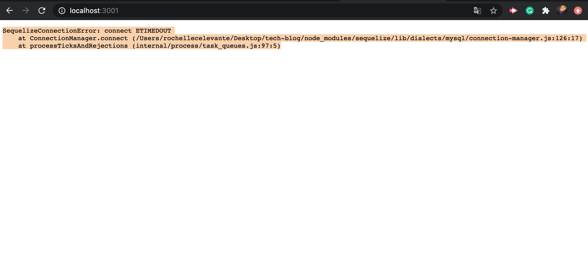
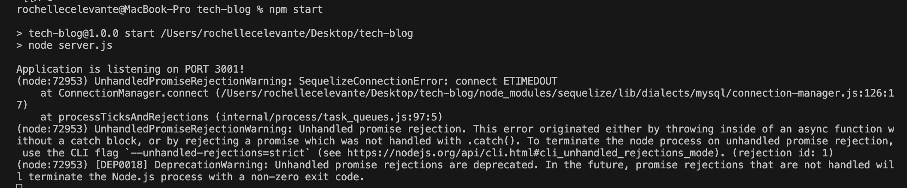

# TECH BLOG

CMS-style blog site similar to a Wordpress site, where developers can publish their blog posts and comment on other developers’ posts as well

# USER STORY

AS A developer who writes about tech
I WANT a CMS-style blog site
SO THAT I can publish articles, blog posts, and my thoughts and opinions

# LANGUAGES

* Vanilla JS
* HTML
* CSS
* Sequelize
* Express Handlesbars
* Express Sessions
* Dotenv

# HOW IT WORKS

It is a website where users can sign up, sign in, sign out, post blog entries, edit blog entries and delete blog entries.
* Challenges
  I did all the code that I can. I referred back to our module and my previous challenge. Although I got it to connect and listen to the port. It gives me such an error. I was going to figure it out on how to fix the error, which I know I can, but I wanted to get started with my next module first and go back to this before I fall behind.

  I still yet to finalize my codes. I will go back and finalize everything. I figured my error came from the connection.js. I found some documetation about "dialect". Since I put mysql for dialect but `npm i mysql2`, I figured I should change it as well. It did not quite work. It must be something else. Please find attached images below for error referrence.

  

  
# AUTHOR

Rochelle Ruiz

